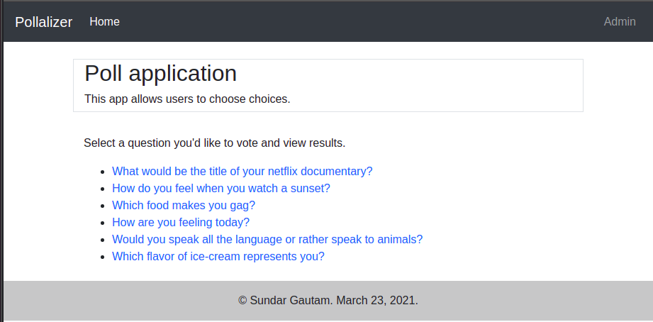

# Pollalizer

Pollalizer allows your company to take your customer's opinions in forms of questions and choices. The questions are easy to enter: simply visit the Django admin panel and you'll feel like at home. Then you can send the questions to your users and take their surveys; and you can utilize this to build your compny's Business Intelligence (BI).

## Technical Specifications

* A "battery-included" Django project with ad admin panel that allows your company staff to add/edit/delete questions and choices.
* A responsive frontend designed using Bootstrap
* MVC architecture, powered by SQLite database

## Author
Sundar Gautam
